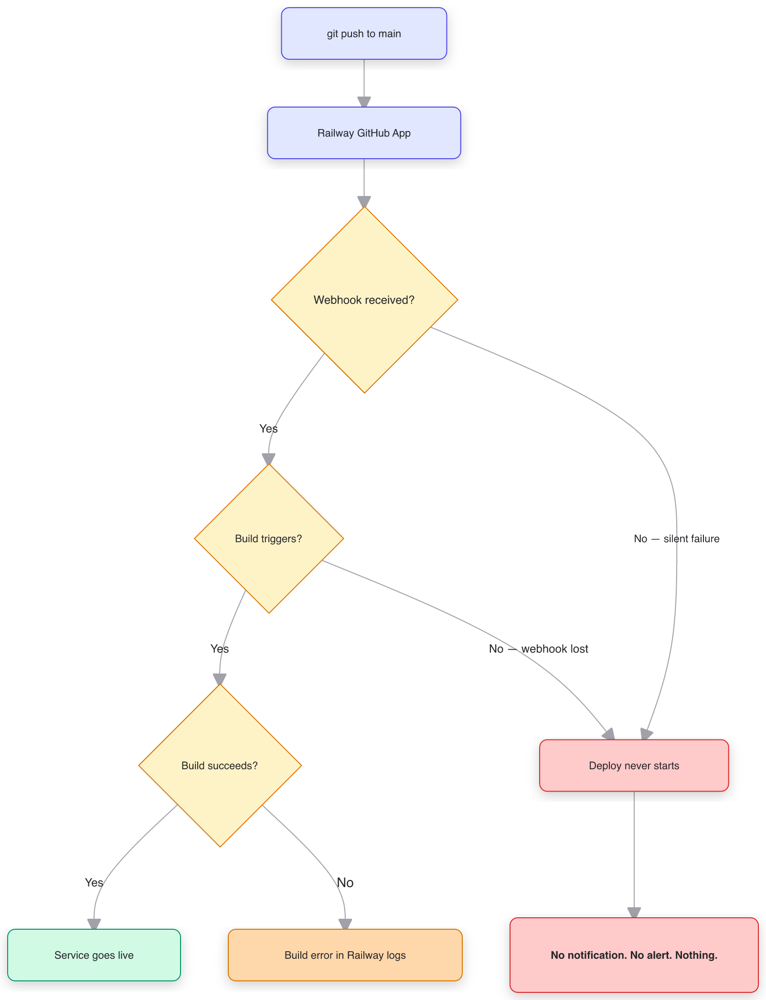
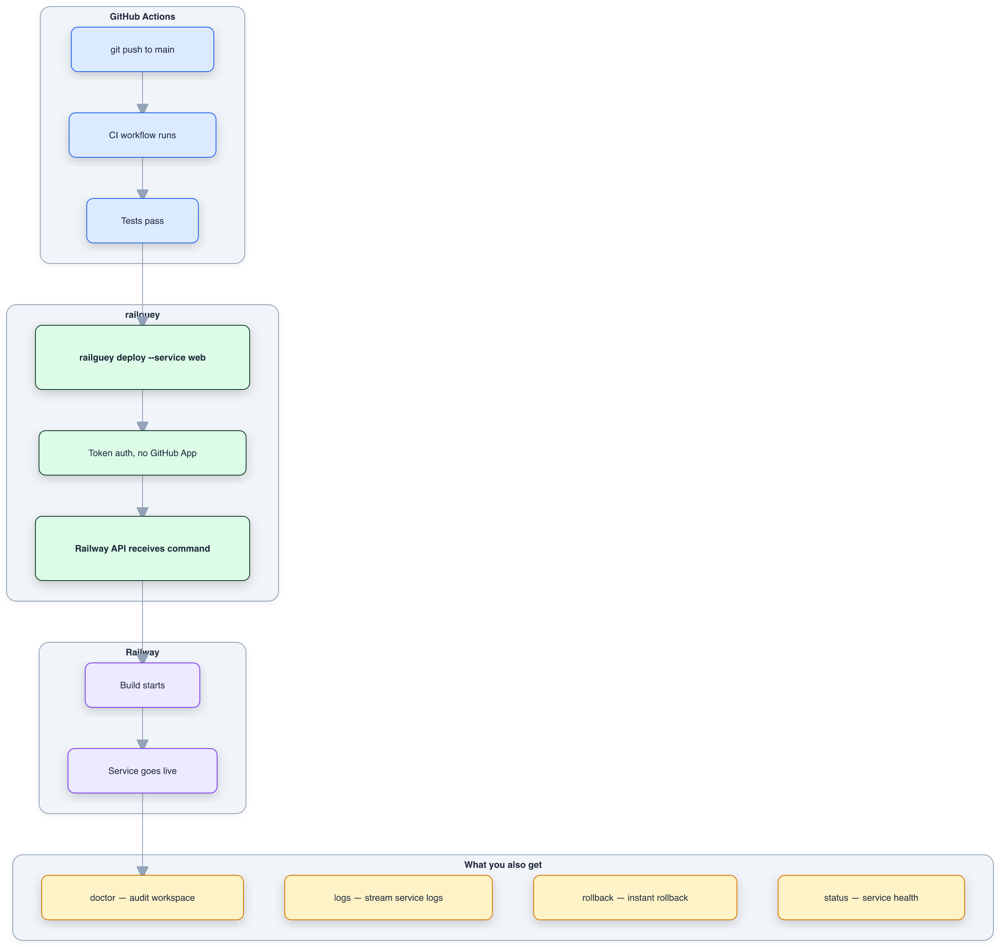

<p align="center">
  
</p>

<p align="center">
  Project-scoped Railway MCP server.<br>
  Reads <code>RAILWAY_TOKEN</code> from each project's <code>.env.local</code> — no <code>railway login</code> needed.
</p>

<p align="center">
  <a href="https://pypi.org/project/railguey/"></a>
  <a href="https://github.com/rhea-impact/railguey/actions/workflows/test.yml"></a>
  <a href="https://pypi.org/project/railguey/"></a>
  <a href="LICENSE"></a>
</p>

---

**railguey is for teams and businesses that need reliable Railway deployments.** It is not the simplest way to deploy — Railway's built-in GitHub app is simpler. But railguey is more reliable, because it draws a cleaner engineering boundary.

## Why not just use Railway's GitHub App?

Railway's GitHub App is fast to set up: connect your repo, push to main, and your service deploys. For prototyping, that speed is genuinely great. But speed of setup and quality of engineering are different things.

The GitHub App bundles five responsibilities into one opaque chain: watch for code changes, authenticate to GitHub, receive a webhook, clone the repo, build and deploy. When the chain works, it feels like magic. When it doesn't — and it has broken [four times in four months](WHY-RAILGUEY.md#the-incident-timeline) — there is no observability, no retry, and no notification. Your push goes in. Nothing comes out. You find out when a customer does.

<p align="center">
  
</p>

Every decision diamond in this diagram is a place where the chain can silently break. Missed webhooks, lost build triggers, GitHub App auth failures — all produce the same result: **nothing happens, and nobody tells you**.

This isn't a bug. It's an architectural choice. Railway chose to own the entire pipeline from push to deploy, which means every failure in GitHub's webhook delivery becomes Railway's problem — and yours.

## How railguey fixes this

railguey separates concerns. GitHub Actions watches your repo (GitHub watching GitHub — the thing it was built for). railguey handles the deploy via Railway's API using project-scoped tokens. Railway builds and runs your service (the thing *it* was built for). Each system does one job.

<p align="center">
  
</p>

If CI fails, GitHub tells you. If the deploy fails, the CLI returns an error. If the service is unhealthy, `railguey doctor` catches it. Every step is observable, retryable, and owned by the system best suited to do it.

**Fast delivery and good engineering aren't opposites** — but Railway's GitHub App trades the second for the first. railguey gives you both.
| Doc | What it covers |
|-----|---------------|
| **[WHY-NOT-RAILWAY-APP.md](WHY-NOT-RAILWAY-APP.md)** | The architectural argument — why coupling CI/CD triggering with deployment is a design flaw, not just a bug |
| **[WHY-RAILGUEY.md](WHY-RAILGUEY.md)** | The evidence — four incidents, community reports, and what the project-token pattern does differently |

## When to use railguey

- You manage Railway services from AI agents (Claude Code, Cursor, etc.) and want them to deploy, rollback, and read logs without `railway login`
- You run multiple Railway projects and want one auth pattern across local dev, CI/CD, and AI tooling
- Deploy reliability matters — production services, client projects, anything where a silently missed deploy costs you
- You're already using GitHub Actions and want Railway deploys in the same pipeline as your tests

## When NOT to use railguey

- **Quick demos and hobby projects.** Railway's GitHub app is genuinely convenient for push-and-forget deploys. If you're prototyping and don't care about deploy reliability, the built-in integration is fine.
- **You don't use an MCP client or CLI.** railguey includes both an MCP server and a CLI. But if you only deploy once in a while from the terminal, the Railway CLI with a project token is enough.
- **You're happy with the dashboard.** If you deploy once a week and check status manually, railguey adds complexity you don't need.

## Known limitations

- **All tools depend on Railway's Backboard GraphQL API**, which isn't officially documented. The schema could change without notice.
- **No Railway CLI required.** All 17 tools use pure GraphQL with project-scoped tokens. The CLI backend module still exists for backward compatibility but is no longer used by any tool.
- **One token per project.** Project-scoped tokens can't query across projects. If you manage 10 projects, you need 10 `.env.local` files in 10 workspaces. This is by design (isolation), but it's more setup than a user-level login.

## Install

Requires Python 3.10+. No Railway CLI needed.

```bash
pip install railguey
```

Or run without installing:

```bash
uvx railguey --help
```

<details>
<summary>Install from source</summary>

```bash
git clone https://github.com/rhea-impact/railguey.git
cd railguey
pip install -e .
```

</details>

## CLI usage

`pip install railguey` gives you the `railguey` command with all 17 tools as subcommands:

```bash
railguey status ~/repos/my-app
railguey logs ~/repos/my-app cerebro --lines 50
railguey deploy ~/repos/my-app web
railguey deployments ~/repos/my-app cerebro --limit 5
railguey doctor ~/repos/my-app
railguey variables ~/repos/my-app web
railguey service-info ~/repos/my-app cerebro
```

Every command takes a `workspace` path — the directory containing `.env.local` with `RAILWAY_TOKEN`.

## Configure Claude Code (MCP)

The recommended setup uses the Claude Code CLI to register railguey as a user-level MCP server:

```bash
pip install railguey
claude mcp add --scope user railguey -- railguey serve
```

This makes railguey available in every Claude Code session, across all projects. The `--scope user` flag writes to `~/.claude.json` so it persists globally.

<details>
<summary>Manual config (alternative)</summary>

Add to `~/.claude.json` under `mcpServers`:

```json
{
  "mcpServers": {
    "railguey": {
      "command": "railguey",
      "args": ["serve"]
    }
  }
}
```

</details>

<details>
<summary>From source (development)</summary>

```bash
git clone https://github.com/rhea-impact/railguey.git
cd railguey
pip install -e .
claude mcp add --scope user railguey -- railguey serve
```

Or manually in `~/.claude.json`:

```json
{
  "mcpServers": {
    "railguey": {
      "command": "python3",
      "args": ["-m", "railguey.mcp"]
    }
  }
}
```

</details>

## Tools

17 tools, all pure GraphQL. No Railway CLI required — just a project-scoped token.

| Tool | What it does |
|------|-------------|
| `railguey_status` | Project overview — all services, deploy status, domains |
| `railguey_services` | List services with IDs |
| `railguey_logs` | Fetch recent deploy or build logs (with optional filter) |
| `railguey_deploy` | Trigger a deploy from linked source |
| `railguey_redeploy` | Redeploy latest deployment (rebuilds from source) |
| `railguey_restart` | Restart latest deployment (no rebuild, fast) |
| `railguey_variables` | List env vars for a service |
| `railguey_variable_set` | Set an env var (triggers redeploy) |
| `railguey_domain` | Generate a railway.app domain or add a custom domain |
| `railguey_environment_create` | Create a new environment (staging, preview, etc.) |
| `railguey_deployments` | Deployment history with IDs, statuses, timestamps, rollback eligibility |
| `railguey_rollback` | Roll back to a specific deployment |
| `railguey_service_info` | Full service config — build/start commands, healthcheck, region, replicas |
| `railguey_http_logs` | HTTP request logs — status codes, latency, paths |
| `railguey_deployment_logs` | Logs for a specific deployment by ID (deploy or build, with filter) |
| `railguey_unlink_repo` | Disconnect a service from GitHub repo linking |

### Coaching tools

| Tool | What it does |
|------|-------------|
| `railguey_doctor` | Audit a workspace for deployment best practices (4-point check) |

`railguey_doctor` checks:
1. `RAILWAY_TOKEN` exists in `.env.local`
2. `.env.local` is in `.gitignore`
3. GitHub Actions deploy workflow exists with token-based CI/CD
4. No services linked to GitHub repos

Every tool requires a `workspace` parameter — the absolute path to a project directory that has a `.env.local` (or `.env`) containing `RAILWAY_TOKEN`.

## Example

**CLI:**
```bash
railguey logs ~/repos/my-app web --lines 50
```

**MCP (via AI agent):**
```python
railguey_logs(workspace="/Users/you/repos/my-app", service="web", lines=50)
```

**Python library:**
```python
from railguey.lib import tools
result = await tools.logs("/Users/you/repos/my-app", "web", lines=50)
```

All three read `/Users/you/repos/my-app/.env.local`, extract the token, and run:

```bash
RAILWAY_TOKEN=<token> railway logs --service web --lines 50
```

## The project-token pattern

Railway lets you create [project-scoped tokens](https://docs.railway.com/guides/cli#project-tokens) — API keys that authenticate to a single project without any user login. These tokens work the same way everywhere:

| Context | How the token is used |
|---------|----------------------|
| **Local dev** | `.env.local` — `railway logs`, `railway up`, etc. |
| **AI agents (railguey)** | Read from `.env.local` at the workspace path |
| **GitHub Actions CI/CD** | Repository secret → `RAILWAY_TOKEN` env var |
| **Any CI system** | Same — export the token, run `railway up` |

One mechanism. No OAuth. No repo linking. No webhook fragility.

<details>
<summary>GitHub Actions deploy workflow (copy-paste)</summary>

Add `RAILWAY_TOKEN` as a [repository secret](https://docs.github.com/en/actions/security-for-github-actions/security-guides/using-secrets-in-github-actions), then:

```yaml
# .github/workflows/deploy.yml
name: Deploy to Railway

on:
  push:
    branches: [main]

jobs:
  deploy:
    runs-on: ubuntu-latest
    steps:
      - uses: actions/checkout@v4

      - name: Install Railway CLI
        run: curl -fsSL https://railway.com/install.sh | sh

      - name: Deploy
        env:
          RAILWAY_TOKEN: ${{ secrets.RAILWAY_TOKEN }}
        run: railway up --service ${{ vars.RAILWAY_SERVICE }} --detach
```

Set `RAILWAY_SERVICE` as a [repository variable](https://docs.github.com/en/actions/writing-workflows/choosing-what-your-workflow-does/store-information-in-variables). More examples in [`examples/`](examples/).

</details>

## Token discovery

1. Looks for `RAILWAY_TOKEN=` in `{workspace}/.env.local`
2. Falls back to `{workspace}/.env`
3. Raises a clear error if not found

Supports bare values, single-quoted, and double-quoted values.

## License

MIT
