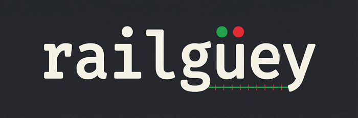

<p align="center">
  
</p>

<p align="center">
  Project-scoped Railway MCP server.<br>
  Reads <code>RAILWAY_TOKEN</code> from each project's <code>.env.local</code> — no <code>railway login</code> needed.
</p>

---

## Why

The official Railway MCP requires `railway login` (user-level OAuth). If you manage multiple projects across different orgs, each with its own project-scoped token in `.env.local`, the official MCP can't use them.

**railguey** fixes this: every tool takes a `workspace` path, reads the token from that project's `.env.local`, and injects it into Railway CLI calls. No login. No global state. Token-per-project, the way it should work.

## Install

Requires the [Railway CLI](https://docs.railway.com/guides/cli) and Python 3.10+.

```bash
git clone https://github.com/rhea-impact/railguey.git
cd railguey
pip install -e .
```

## Configure Claude Code

Add to `~/.claude.json` under `mcpServers`:

```json
{
  "mcpServers": {
    "Railway": {
      "command": "python3",
      "args": ["/path/to/railguey/server.py"]
    }
  }
}
```

## Tools

| Tool | What it does |
|------|-------------|
| `railguey_status` | Project overview — all services and their state |
| `railguey_services` | List services with deployment status |
| `railguey_deployments` | Deployment history for a service (IDs, statuses, timestamps) |
| `railguey_logs` | Fetch recent logs (deploy or build, with optional filter) |
| `railguey_deploy` | Deploy from source (non-blocking) |
| `railguey_redeploy` | Redeploy latest deployment (rebuilds from source) |
| `railguey_restart` | Restart latest deployment (no rebuild, fast) |
| `railguey_variables` | List env vars for a service |
| `railguey_variable_set` | Set an env var (triggers redeploy) |
| `railguey_domain` | Generate a railway.app domain or add a custom domain |
| `railguey_environment_create` | Create a new environment (staging, preview, etc.) |

Every tool requires a `workspace` parameter — the absolute path to a project directory that has a `.env.local` (or `.env`) containing `RAILWAY_TOKEN`.

## Example

```python
railguey_logs(workspace="/Users/you/repos/my-app", service="web", lines=50)
```

This reads `/Users/you/repos/my-app/.env.local`, extracts the token, and runs:

```bash
RAILWAY_TOKEN=<token> railway logs --service web --lines 50
```

## The Project-Token Pattern

railguey exists because of a conviction: **project-scoped tokens are the right way to manage Railway deployments.** Not user-level OAuth. Not GitHub repo linking. One token per project, used everywhere.

### The problem with Railway's GitHub integration

Railway offers automatic deploys by linking a GitHub repo to a service. In practice (Jan–Feb 2026), this has been unreliable — deploys silently fail, webhooks go missing, and debugging requires toggling the integration off and on. When it breaks at 2am, you're stuck in a dashboard clicking buttons.

### The project-token alternative

Railway lets you create [project-scoped tokens](https://docs.railway.com/guides/cli#project-tokens) — API keys that authenticate to a single project without any user login. These tokens work the same way everywhere:

| Context | How the token is used |
|---------|----------------------|
| **Local dev** | `.env.local` — `railway logs`, `railway up`, etc. |
| **AI agents (railguey)** | Read from `.env.local` at the workspace path |
| **GitHub Actions CI/CD** | Repository secret → `RAILWAY_TOKEN` env var |
| **Any CI system** | Same — export the token, run `railway up` |

One mechanism. No OAuth. No repo linking. No webhook fragility.

### GitHub Actions: deploy without repo linking

Instead of connecting Railway to your GitHub repo, use the project token directly in a GitHub Actions workflow. This gives you full control over when and how deploys happen.

Add `RAILWAY_TOKEN` as a [repository secret](https://docs.github.com/en/actions/security-for-github-actions/security-guides/using-secrets-in-github-actions) in your GitHub repo settings, then use this workflow:

```yaml
# .github/workflows/deploy.yml
name: Deploy to Railway

on:
  push:
    branches: [main]

jobs:
  deploy:
    runs-on: ubuntu-latest
    steps:
      - uses: actions/checkout@v4

      - name: Install Railway CLI
        run: curl -fsSL https://railway.com/install.sh | sh

      - name: Deploy
        env:
          RAILWAY_TOKEN: ${{ secrets.RAILWAY_TOKEN }}
        run: railway up --service ${{ vars.RAILWAY_SERVICE }} --detach
```

Set `RAILWAY_SERVICE` as a [repository variable](https://docs.github.com/en/actions/writing-workflows/choosing-what-your-workflow-does/store-information-in-variables) (not a secret — service names aren't sensitive).

This pattern:
- Deploys only on push to `main` (or whatever branch/event you choose)
- Gives you the full GitHub Actions toolkit — run tests first, deploy on success, notify on failure
- Works identically across every repo — no per-repo Railway integration setup
- Survives Railway integration outages because it's just a CLI call

### Multiple services, one repo

If your repo deploys multiple Railway services (e.g. a web app and a worker):

```yaml
    steps:
      - uses: actions/checkout@v4

      - name: Install Railway CLI
        run: curl -fsSL https://railway.com/install.sh | sh

      - name: Deploy web
        env:
          RAILWAY_TOKEN: ${{ secrets.RAILWAY_TOKEN }}
        run: railway up --service web --detach

      - name: Deploy worker
        env:
          RAILWAY_TOKEN: ${{ secrets.RAILWAY_TOKEN }}
        run: railway up --service worker --detach
```

Same token. Same pattern. No linking gymnastics.

## Token Discovery

1. Looks for `RAILWAY_TOKEN=` in `{workspace}/.env.local`
2. Falls back to `{workspace}/.env`
3. Raises a clear error if not found

Supports bare values, single-quoted, and double-quoted values.

## License

MIT
